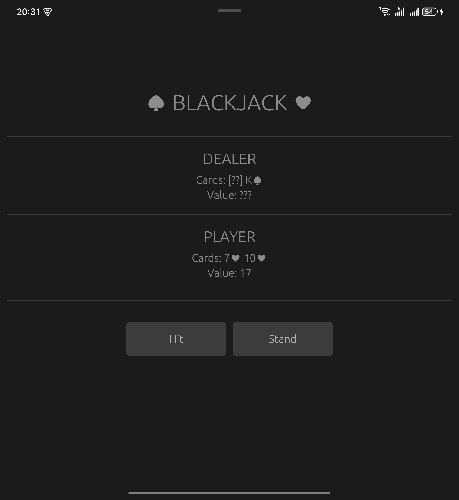

# Rustjack Mobile
Mobile version of Rustjack, using eGUI.




## compile for desktop
```bash
cargo run
```

## Compile for Android
This uses xbuild and adb:
```bash
bash build_android.sh
```

you may need the android SDK tools in your path to make adb work:

```bash
export PATH=$PATH:~/Android/Sdk/platform-tools
```